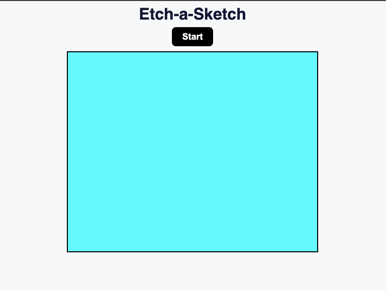

# Etch-a-Sketch

This is a simple JavaScript Etch-a-Sketch web application

## Table of contents

- [Overview](#overview)
  - [Screenshot](#screenshot)
  - [Links](#links)
- [My process](#my-process)
  - [Built with](#built-with)
  - [What I learned](#what-i-learned)
  - [Continued development](#continued-development)
- [Author](#author)

## Overview

### Screenshot

### Links

- Live Site URL: [Link](https://etch-a-sketch-417fc51dea9f.herokuapp.com/)

## My process

### Built with

- HTML5 markup
- CSS
- JavaScript

### What I learned

This was a pretty simple project but good practice to re-enforce my knowledge of JavaScript.

### Continued development

I am going to start developing projects using a framework such as Next.js rather than just HTML and CSS

## Author

- Website - [Charles Leighton](https://www.chleighton.live/)
